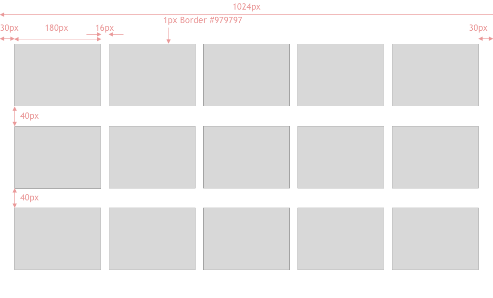
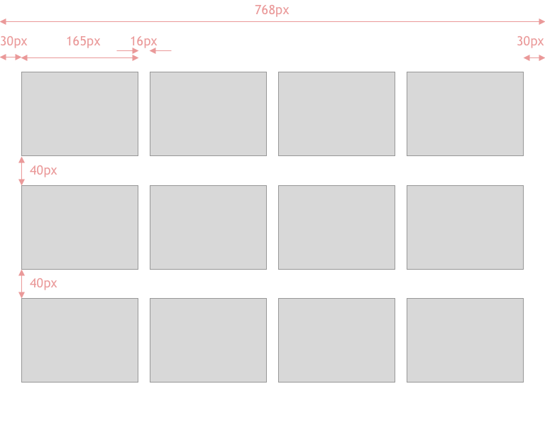
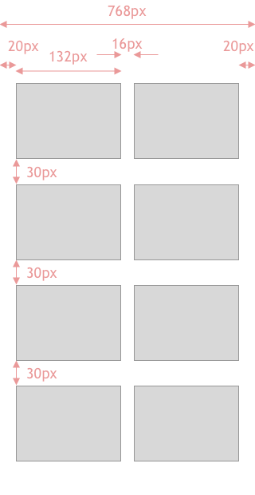

# Coding tasks


## Task 1 - gallery

> Developed using 12.14v

We have a need to display a series of images on the page and are developing an image gallery component. 

Run:

```
npm run start
```

The browser should launch automatically.

Browse to /gallery to view the gallery component

We would like you to write code to perform the following steps

1. fetch data from the URL provided (inside `gallery/index.js`) using any preferred solution (fetch, axios, etc...)
2. render it into the page as a gallery of cards, each with an image and a title
3. styles using the `gallery/index.css` please you can use the designs included 
4. Write tests, 


##Designs 

###Desktop

###Tablet

###Mobile



